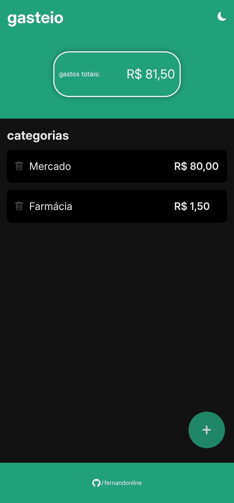
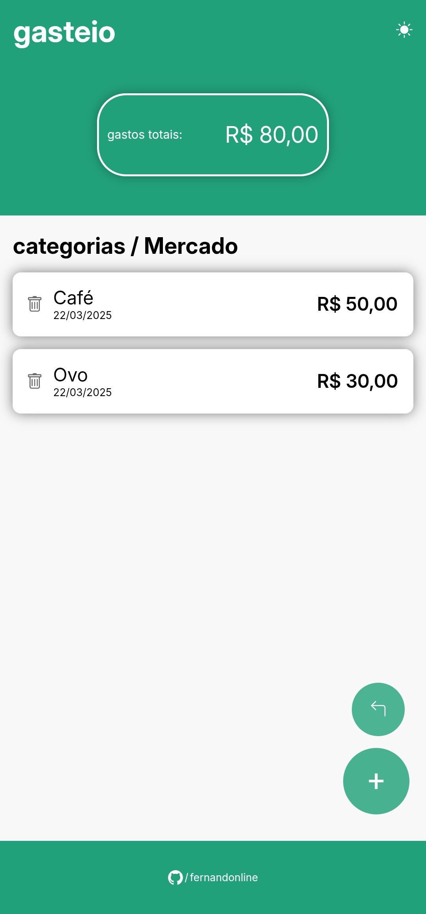

# Gasteio

Gasteio é um software mobile desenvolvido para facilitar o gerenciamento de despesas pessoais ou familiares. Com ele, você pode criar diferentes categorias para organizar suas despesas de forma prática e eficiente. Dentro de cada categoria, é possível registrar despesas individuais, incluindo detalhes como título, data e valor. Na interface principal, você pode visualizar o valor total acumulado de todas as categorias ou verificar os gastos específicos ao acessar cada uma delas. 
O Gasteio foi criado para simplificar o controle financeiro do seu dia a dia, e continuará recebendo atualizações de interface e novas funcionalidades para oferecer uma experiência ainda mais completa.

[Baixar para Android](https://www.mediafire.com/file/1xex298ygsoeozz/Gasteio.apk/file)
| Versão: 1.2.1 | Data: 28/04/2025
- log: pequenas correções de interface, agora aninha os gastos adicionados na mesma data. correção na data atual do dispositivo.

<span>Versões anteriores</span>

- 23/03/3035 1.0.0: versão de lancamento.
- 25/03/2025 1.0.2: correção no armazenamento de dados locais.

<div>
        
    
</div>

## Tecnologias Utilizadas

- **IDE Recomendada**: [VSCode](https://code.visualstudio.com/) com extensão [Volar](https://marketplace.visualstudio.com/items?itemName=Vue.volar)
- **Frontend**: Vue Framework com TypeScript
- **Mobile**: Capacitor para compilação em Android
- **Ferramentas de Desenvolvimento**: npm, Android Studio

## Configuração do Projeto

### Instale as dependências
```sh
npm install
```
### Iniciar o servidor de desenvolvimento
```sh
npm run dev
```
### Compilação para produção
```sh
npm run build
```

### Adicione a plataforma Android
```sh
npx cap add android
```
### Sincronize o build com o Capacitor
```sh
npx cap sync android
```

### Abra o projeto no Android Studio
```sh
npx cap open android
```

## Estrutura do Projeto
```
├── src/                   # Código fonte principal do aplicativo
│   ├── assets/            # Imagens, ícones e outros recursos estáticos
│   ├── components/        # Componentes reutilizáveis do Vue Framework
│   │   ├── containers/    # Base de formulários
│   │   ├── elements/      # Elementos reutilizáveis (botões, inputs, etc.)
│   │   └── layouts/       # Componentes de estrutura (header, footer, etc.)
│   ├── stores/            # Gerenciamento de estado e lógica de negócios
│   └── views/             # Telas principais da aplicação
```
